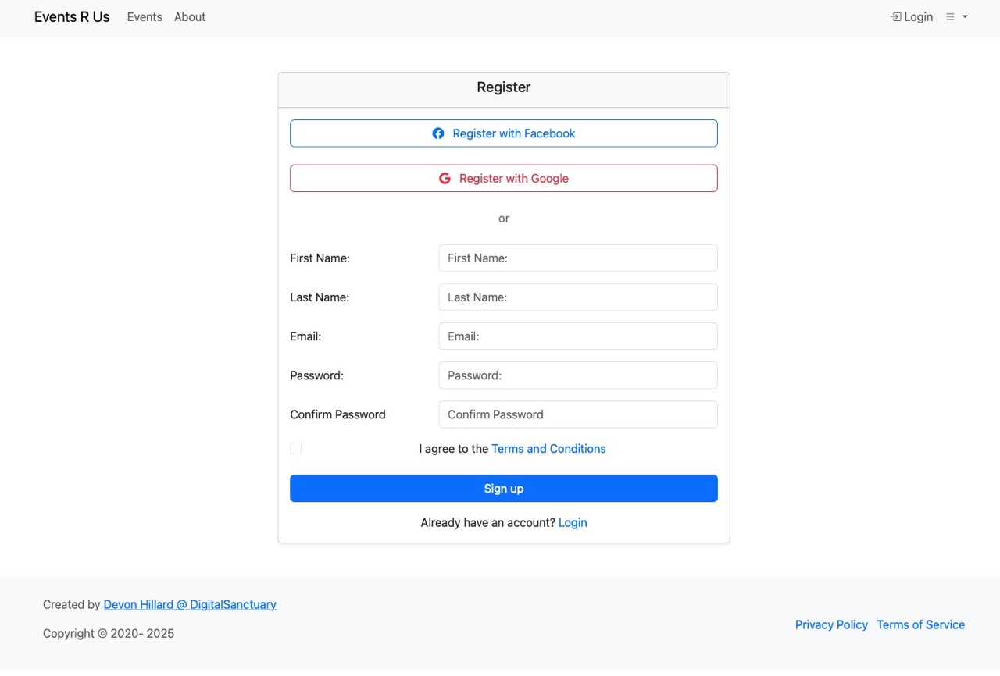

# Spring User Framework Demo Application

[](https://opensource.org/licenses/Apache-2.0)
[](https://adoptium.net/temurin/releases/?version=21)

A demo application for the [Spring User Framework](https://github.com/devondragon/SpringUserFramework). It
runs the framework's user-management surface (registration with email verification, login, passkeys, MFA,
OAuth2 and OIDC, password reset, profile editing, account deletion) behind a working Thymeleaf and Bootstrap
UI, and adds a small event-management domain on top to show how application code builds on the framework's
identity and authorization. The HTML, JavaScript, and configuration here are meant to be copied into your own
application as a starting point.



Documentation for this demo is in [docs/](docs); the framework's own documentation lives in
[its repository](https://github.com/devondragon/SpringUserFramework/blob/main/README.md).

## Version compatibility

| Demo version | Spring Boot | Spring User Framework | Java | Branch or tag |
| --- | --- | --- | --- | --- |
| main | 4.1.x | 5.3.x | 21 | `main` |
| 1.0.0-springboot3 | 3.5.x | 3.5.x | 17 | [`v1.0.0-springboot3`](https://github.com/devondragon/SpringUserFrameworkDemoApp/tree/v1.0.0-springboot3) |

`main` is on Spring Boot 4.1.0 and framework 5.3.0 ([build.gradle](build.gradle)). For the Spring Boot 3.5.6
and framework 3.5.1 combination on Java 17, `git checkout v1.0.0-springboot3` after cloning.

## What this demo shows

| Capability | Where it lives | Details |
| --- | --- | --- |
| Application-specific user profile sharing the framework user's key | [`user/profile/`](src/main/java/com/digitalsanctuary/spring/demo/user/profile) | [EXTENDING.md](docs/EXTENDING.md#custom-user-profile-stack) |
| Cleaning up application data when an account is deleted | [`UserProfileDeletionListener`](src/main/java/com/digitalsanctuary/spring/demo/user/profile/UserProfileDeletionListener.java) | [EXTENDING.md](docs/EXTENDING.md#cleaning-up-application-data-when-a-user-is-deleted) |
| An application domain (events) using privilege-based access control | [`event/`](src/main/java/com/digitalsanctuary/spring/demo/event), roles in [`application.yml`](src/main/resources/application.yml) | [EXTENDING.md](docs/EXTENDING.md#building-your-own-domain-on-the-framework-events) |
| Allowing or denying registrations through the `RegistrationGuard` SPI | [`DomainRegistrationGuard`](src/main/java/com/digitalsanctuary/spring/demo/registration/DomainRegistrationGuard.java), `registration-guard` profile | [AUTHENTICATION.md](docs/AUTHENTICATION.md#registration-guard) |
| Passkey sign-in, enrollment, management, and passwordless registration | [`static/js/user/`](src/main/resources/static/js/user) (`webauthn-*.js`) | [AUTHENTICATION.md](docs/AUTHENTICATION.md#passkeys) |
| Two-factor login, password plus passkey | [`application-mfa.yml`](src/main/resources/application-mfa.yml), [`user/mfa/`](src/main/resources/templates/user/mfa) | [AUTHENTICATION.md](docs/AUTHENTICATION.md#mfa) |
| OAuth2 login with Google and Facebook | [`application-local.yml-example`](src/main/resources/application-local.yml-example) | [AUTHENTICATION.md](docs/AUTHENTICATION.md#oauth2-with-google-and-facebook) |
| OIDC login against a bundled Keycloak, as a runnable stack | [`docker-compose-keycloak.yml`](docker-compose-keycloak.yml), [`keycloak/`](keycloak) | [AUTHENTICATION.md](docs/AUTHENTICATION.md#keycloak) |
| Remember-me cookies | [`login.html`](src/main/resources/templates/user/login.html), [`application.yml`](src/main/resources/application.yml) | [AUTHENTICATION.md](docs/AUTHENTICATION.md#remember-me) |
| Admin page and API that lock and unlock accounts | [`AdminController`](src/main/java/com/digitalsanctuary/spring/demo/controller/AdminController.java), [`AdminAPIController`](src/main/java/com/digitalsanctuary/spring/demo/controller/AdminAPIController.java) | [AUTHENTICATION.md](docs/AUTHENTICATION.md#admin) |
| Reference templates, JavaScript, and message bundle to copy | [`templates/`](src/main/resources/templates), [`static/js/`](src/main/resources/static/js) | [EXTENDING.md](docs/EXTENDING.md#reference-templates-javascript-and-messages) |
| Replacing a framework service with your own | [`CustomUserEmailService`](src/main/java/com/digitalsanctuary/spring/demo/service/CustomUserEmailService.java) | [EXTENDING.md](docs/EXTENDING.md#overriding-a-framework-service) |
| A test-only API, profile-gated and loopback-only, for E2E runs | [`TestDataController`](src/main/java/com/digitalsanctuary/spring/demo/test/api/TestDataController.java) | [EXTENDING.md](docs/EXTENDING.md#profile-gated-test-only-endpoints) |
| Browser tests covering the flows above | [`playwright/`](playwright) | [TESTING.md](docs/TESTING.md#playwright-e2e-tests) |

## Project layout

```
src/main/java/com/digitalsanctuary/spring/demo/
├── controller/       AdminController, AdminAPIController, PageController
├── event/            the example domain: entity, repository, service, page and API controllers
├── registration/     DomainRegistrationGuard, the RegistrationGuard SPI sample
├── service/          CustomUserEmailService, a framework service replaced with @Primary
├── test/             the test-only API and its security config, playwright-test profile only
├── user/profile/     the profile entity, repository, service, session holder, and listeners
├── util/             LocaleConfiguration
└── web/              DemoTemplateModelAdvice
src/main/resources/
├── static/js/        user/ (one module per page), admin/, utils/, shared.js
├── templates/        layout.html plus fragments/, user/, event/, admin/, mail/
├── application.yml   base configuration, with one application-<profile>.yml per profile
└── data-local.sql    sample events, loaded under the local profile
src/test/java/com/digitalsanctuary/spring/
├── demo/             tests for this application's own code
└── user/             tests against the framework's user-management surface
playwright/           E2E specs, fixtures, and playwright.config.ts
keycloak/             realm export and TLS material for the Keycloak stack
```

## Quick start

### Docker

Nothing to install but Docker:

```bash
git clone https://github.com/devondragon/SpringUserFrameworkDemoApp.git
cd SpringUserFrameworkDemoApp
docker compose up --build
```

The app image is built from source inside Docker, so the first build takes several minutes. When it is up,
open http://localhost:8080 and register at http://localhost:8080/user/register.html. This stack sets
`USER_REGISTRATION_SENDVERIFICATIONEMAIL=false`, so accounts are enabled at registration and you can log in
immediately. Its `mailserver` container is a relay with no route to real inboxes, so nothing it accepts will
reach an actual mailbox. The stack runs under the `dev` profile and loads no sample events.

Stop it with Ctrl-C, then `docker compose down -v` to remove the containers and their data.

### Locally with Gradle

Needs JDK 21 ([mise.toml](mise.toml) pins it) and a running Docker daemon: `bootRun` starts the MariaDB
container defined in [compose.dev.yaml](compose.dev.yaml) and stops it with the app.

```bash
git clone https://github.com/devondragon/SpringUserFrameworkDemoApp.git
cd SpringUserFrameworkDemoApp
cp src/main/resources/application-local.yml-example src/main/resources/application-local.yml
./gradlew bootRun --args='--spring.profiles.active=local'
```

`application-local.yml` is gitignored, so credentials you put in it stay out of git. Copying it also turns off
the verification email and loads the sample events in
[`data-local.sql`](src/main/resources/data-local.sql). Then open http://localhost:8080, register at
http://localhost:8080/user/register.html, and browse the API at http://localhost:8080/swagger-ui.html.

To use a database you manage yourself instead of the container, set `spring.docker.compose.enabled: false` and
your own `spring.datasource.*` values; see [CONFIGURATION.md](docs/CONFIGURATION.md).

### With Keycloak

`docker compose -f docker-compose-keycloak.yml up -d --build --wait` runs the app against a bundled Keycloak
and its imported `demo` realm. Ports, credentials, and the login walkthrough are in
[keycloak/README.md](keycloak/README.md) and [AUTHENTICATION.md](docs/AUTHENTICATION.md#keycloak).

## Profiles

| Profile | What it is for |
| --- | --- |
| `local` | Everyday local development; needs `application-local.yml` copied from the example |
| `dev` | Debug-heavy dev server; what the `compose.yaml` Docker stack runs |
| `prd` | Production settings: env-driven datasource and URLs, strict cookies, template caching |
| `test` | The JUnit suite on H2, applied automatically by `./gradlew test` |
| `playwright-test` | Add-on: enables the loopback-only test API and disables outbound mail for E2E runs |
| `docker-keycloak` | OIDC against the bundled Keycloak; set for you inside `docker-compose-keycloak.yml` |
| `mfa` | Add-on: requires PASSWORD plus WEBAUTHN, for example `local,mfa` |
| `registration-guard` | Add-on: activates the domain-restricted registration guard, for example `local,registration-guard` |

Pick a base profile with `--spring.profiles.active=`, and list add-ons after it, comma-separated. With no
`--args` at all, `bootRun` still runs `local` ([build.gradle:114-124](build.gradle)). Full per-profile
override lists are in [CONFIGURATION.md](docs/CONFIGURATION.md).

## Documentation

This demo:

- [docs/CONFIGURATION.md](docs/CONFIGURATION.md): profiles, the properties this demo sets, environment
  variables, mail, and security settings.
- [docs/DEVELOPMENT.md](docs/DEVELOPMENT.md): prerequisites, running the app, the Compose files, Gradle
  tasks, logs, LiveReload, and IDE setup.
- [docs/TESTING.md](docs/TESTING.md): the JUnit suite, disabled tests, the Playwright suite and its test
  API, and CI.
- [docs/EXTENDING.md](docs/EXTENDING.md): each framework extension point, the demo code that uses it, and
  what to write in your own app.
- [docs/AUTHENTICATION.md](docs/AUTHENTICATION.md): every authentication path here, how to run it, and its
  configuration.
- [keycloak/README.md](keycloak/README.md): the Keycloak stack, its realm export, and its credentials.
- [CHANGELOG.md](CHANGELOG.md): what changed, by date.

The framework:

- [README.md](https://github.com/devondragon/SpringUserFramework/blob/main/README.md): what the library does
  and how to add it to an application.
- [CONFIG.md](https://github.com/devondragon/SpringUserFramework/blob/main/CONFIG.md): the full property
  reference.
- [MIGRATION.md](https://github.com/devondragon/SpringUserFramework/blob/main/MIGRATION.md): upgrading
  between framework versions.
- [docs/PROFILE.md](https://github.com/devondragon/SpringUserFramework/blob/main/docs/PROFILE.md): the
  user-profile extension contract.
- [docs/REGISTRATION-GUARD.md](https://github.com/devondragon/SpringUserFramework/blob/main/docs/REGISTRATION-GUARD.md):
  the `RegistrationGuard` SPI.

## Testing

```bash
./gradlew test                                     # JUnit suite, test profile, H2
cd playwright && npm ci && npx playwright install  # once
./gradlew playwrightTest                           # E2E, starts the app itself
```

Details, including the MFA-only Playwright project and the test-only API, are in
[docs/TESTING.md](docs/TESTING.md).

## Contributing

Issues and pull requests are welcome at
[SpringUserFrameworkDemoApp](https://github.com/devondragon/SpringUserFrameworkDemoApp/issues). Follow the
patterns already in the code, add tests for new behavior, and make sure `./gradlew test` passes before
opening a pull request. Changes to the library itself belong in the framework repository, which has its own
[CONTRIBUTING.md](https://github.com/devondragon/SpringUserFramework/blob/main/CONTRIBUTING.md).

## License

Apache License 2.0; see [LICENSE](LICENSE).

The application is based on the principles in the
[Baeldung Spring Security Course](https://www.baeldung.com/learn-spring-security-course).

**Disclaimer:** This is a demo project provided as-is with no guarantees of performance, security, or
production readiness.
